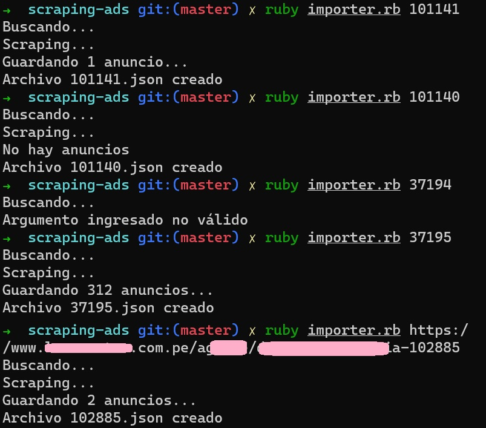

# Parseo de anuncios de inmobiliaria

## Instrucciones de instalación:

1- Clonar el repositorio (en consola): 
```bash
git clone git@github.com:verenisseeyzaguirre/ads-scraper.git
```

2- Ubicarse en la carpeta creada (en consola): 
```bash
cd ads-scraper
```

3. Ejecutar (en consola):
```bash
ruby importer.rb inmobiliaria_id  
```

Ejemplo
```bash
ruby importer.rb 37195
```

## Ejecución de script en consola

 
 
 
## Ejemplo de archivo JSON generado
[inmobiliaria_id =  37195](https://github.com/verenisseeyzaguirre/ads-scraper/blob/master/output/37195.json)
